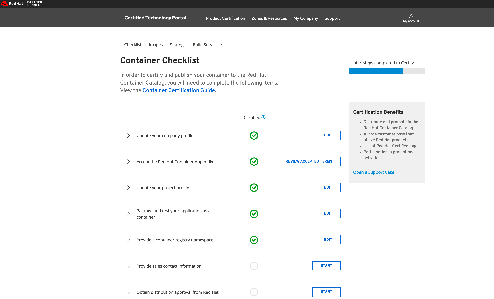
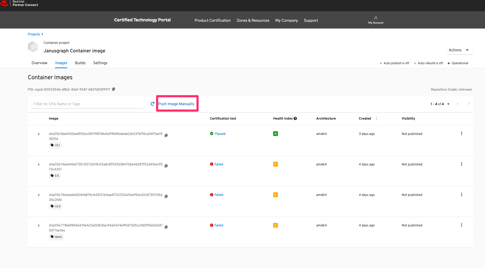
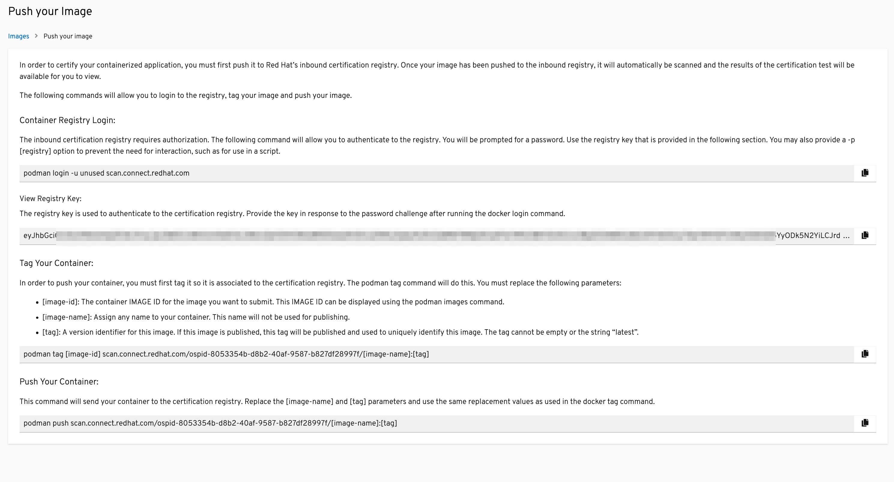
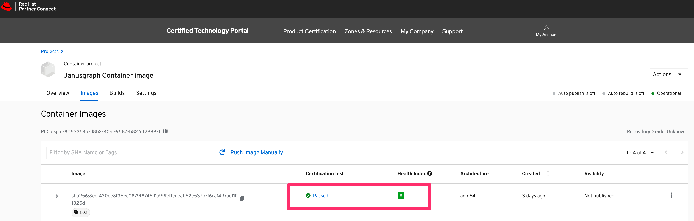
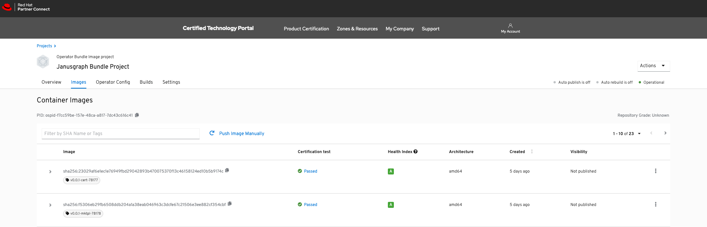
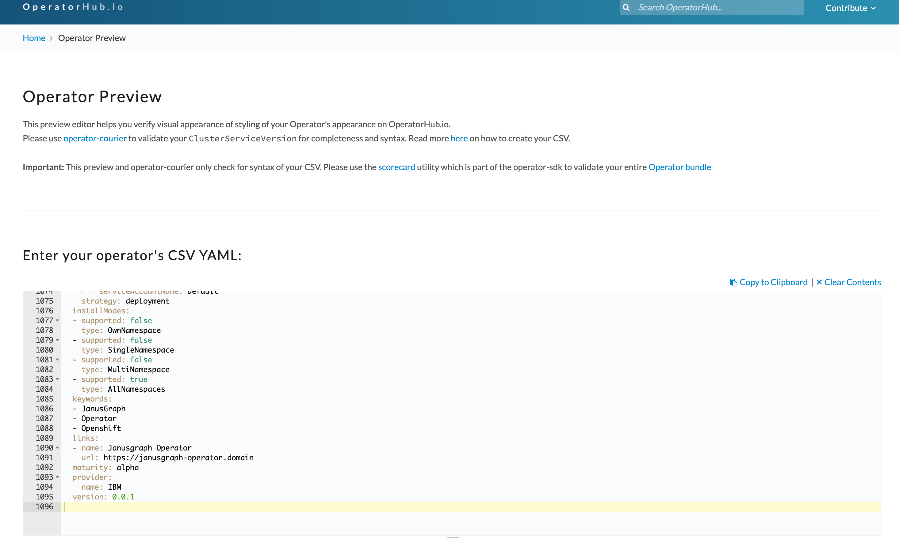
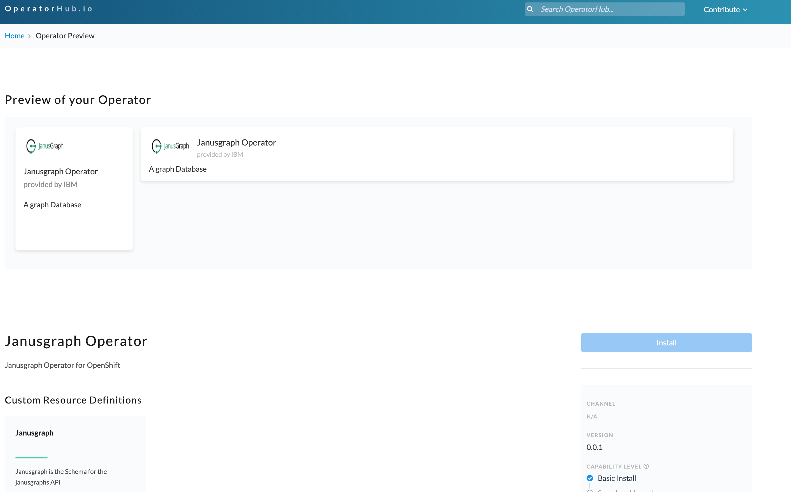

# Certifying Janusgraph Image

In this tutorial, we will learn about how to prepare and certify your JanusGraph container so that you could deploy Janusgraph Operator to RedHat OpenShift.

# Prerequisites

* Follow the prerequisite steps as mentioned in the [Program Prerequisites](https://redhat-connect.gitbook.io/partner-guide-for-red-hat-openshift-and-container/program-on-boarding/prerequisites). These prerequisites are part of [Certification Workflow](https://redhat-connect.gitbook.io/partner-guide-for-red-hat-openshift-and-container/program-on-boarding/certification-workflow).


The certification of an operator is done in 3 stages as follows: 
1. JanusGraph container image certification
1. JanusGraph operator image certification
1. JanusGraph operator bundle image certification

## 1. JanusGraph container image certification
### Steps

1. The base image that is used to build Janusgraph image should be supported by RedHat. In the Janusgraph docker project that you have cloned, find the `Dockerfile` and use the following RedHat supported `OpenJDK` image:

```bash
FROM registry.access.redhat.com/ubi8/openjdk-8:1.3-12
```

> NOTE: There are higher versions of OpenJDK available and can be used as well.

2. The JanusGraph image should run as `non-root` user but part of the `root` group. To do this, we have added the following changes to the existing Janusgraph `Dockerfile`

* Add a non-root user `9999` and assign that user the folders
```bash
RUN groupadd -r janusgraph --gid=9999 && \
    useradd -r -g janusgraph --uid=9999 -d ${JANUS_DATA_DIR} janusgraph && \
```

* Change the group of the folders to `root` group.
```bash
chown -R 9999:9999 ${JANUS_HOME} ${JANUS_INITDB_DIR} ${JANUS_CONFIG_DIR} ${JANUS_DATA_DIR} && \

chgrp -R 0 ${JANUS_HOME} ${JANUS_INITDB_DIR} ${JANUS_CONFIG_DIR} ${JANUS_DATA_DIR} && \

chmod -R g+w ${JANUS_HOME} ${JANUS_INITDB_DIR} ${JANUS_CONFIG_DIR} ${JANUS_DATA_DIR}

```

3. Add following labels to the Janusgraph Operator Dockerfile.

```bash
  LABEL name="JanusGraph Operator Using Cassandra" \
  maintainer="sanjeev.ghimire@ibm.com" \
  vendor="JanusGraph" \
  version=${JANUS_VERSION} \
  release="1" \
  summary="This is a JanusGraph operator that ensures stateful deployment in an OpenShift cluster." \
  description="This operator will deploy JanusGraph in OpenShift cluster."  
```

4. Copy the licenses folder for JanusGraph Operator to your container:

```bash
  # Required Licenses for Red Hat build service and scanner
COPY licenses /licenses
```

5. Build and deploy the operator image by running the following script:

```bash
$ ./build-images-ibm.sh -- if you have created a new file
```
OR

```bash
$ ./build-images.sh -- if you have modified file provided by Janusgraph
```

6. From the RedHat Partner Connect portal, create the container application project before uploading your image by following below link:

https://redhat-connect.gitbook.io/partner-guide-for-red-hat-openshift-and-container/certify-your-operator/creating-an-operator-project/creating-container-project

7. Make sure the certification checklist are all completed and you see green check mark.



>NOTE: The sales contact information and distribution approval from Redhat in the checklist items, which can be added later, are optional for container image certification.

8. Now, you can push your container image for certification. It can be done manually from your local build or configure the build service in `RedHat Connect Portal`.

### Push Container Image manually

You can follow the instructions from the RedHat Connect Portal, by clicking the `Push Images Manually` link from your project page.



which brings to this page:



>NOTE that the page you see is using podman cli command, but you can use docker instead of podman.

Follow the steps to push container image manually:
* Login to the RedHat Connect Registry: 
`docker login -u unused scan.connect.redhat.com -p <registry key>`
* Find the image id of your container image using: `docker images |grep janusgraph-docker`
* Tag your container image using: 
`docker tag <image id> scan.connect.redhat.com/<OSPID>/janusgraph-docker:<version>` . Make sure to use the correct URL thats given in `Push your image` page from RedHat Connect Portal.
>Replace `image id` and `version` with respective values.
* Push your container image for scanning using: 
`docker push scan.connect.redhat.com/<OSPID>/janusgraph-docker:<version>`
>Replace `version` with the values used when tagging.

>NOTE: You can find your project registry key and ospid by going to your project in RedHat Connect Portal and clicking `Push Images Manually` or you can copy the full URL instead of copying just the OSPID

Then you can see your container image in RedHat Connect Portal scanning for any issues in your image. If no issues found you can see the image `Certification test` as being `passed`.




## 2. JanusGraph operator image certification

In previous step, you already created a container project and certified the container image. You can use the same project to certify the JanusGraph operator image. Before we create JanusGraph operator image few things needs to be changed:

* Update Dockerfile to use RedHat supported base image in `Dockerfile`

Replace:
```bash
# Use distroless as minimal base image to package the manager binary
# Refer to https://github.com/GoogleContainerTools/distroless for more details
FROM gcr.io/distroless/static:nonroot
```

With

```bash
FROM registry.access.redhat.com/ubi8/ubi-minimal:latest
```

* Add the following labels to `Dockerfile` right after base image:

```bash
FROM registry.access.redhat.com/ubi8/ubi-minimal:latest

LABEL name="JanusGraph Operator Using Cassandra" \
  maintainer="Sanjeev Ghimire:sanjeev.ghimire@ibm.com" \
  vendor="IBM" \
  version="v0.0.1" \
  release="1" \
  summary="This is a JanusGraph operator that ensures stateful deployment in an OpenShift cluster." \
  description="This operator will deploy JanusGraph in OpenShift cluster."

```

* Add appropriate licenses to `licenses` folder, create licenses folder if you don't have one and update `Dockerfile` to copy the license directory:

```bash
# Use UBI image as base image
FROM registry.access.redhat.com/ubi8/ubi-minimal:latest
LABEL name="JanusGraph Operator Using Cassandra" \
  maintainer="Sanjeev Ghimire:sanjeev.ghimire@ibm.com" \
  vendor="IBM" \
  version="v0.0.1" \
  release="1" \
  summary="This is a JanusGraph operator that ensures stateful deployment in an OpenShift cluster." \
  description="This operator will deploy JanusGraph in OpenShift cluster."

# Required Licenses for Red Hat build service and scanner
COPY licenses /licenses
```

* Make sure to push the operator and test in your cluster by running:

```bash
./build-and-push-operator.sh

./deploy-operator.sh

```

* Upload operator image to RedHat project registry:

First find the image id of the operator image you built in last step. From terminal run: 

```bash
docker images | grep `janusgraph-operator`
```

Then, login to your project

```bash
docker login -u unused scan.connect.redhat.com -p <project registry key>

docker tag <image id> scan.connect.redhat.com/<ospid-id>/janusgraph-operator:v0.0.1

# Push the iamge to the RH registry
$ docker push scan.connect.redhat.com/<ospid-id>/janusgraph-operator:v0.0.1

```

>NOTE: You can find your project registry key and ospid by going to your project in RedHat Connect Portal and clicking `Push Images Manually`

* Go to `https://connect.redhat.com/project/<project_id>/images` to check the status of certification.

It might take a while for the image to appear. You then need to wait for the certification process to finish.

If "certification test" passed then continue to next step. Otherwise, check the scan logs for errors and update the image accordingly.

## 3. JanusGraph operator bundle image certification

### Steps

1. Create an operator bundle image project using the following link:
https://redhat-connect.gitbook.io/partner-guide-for-red-hat-openshift-and-container/certify-your-operator/certify-your-operator-bundle-image/creating-operator-bundle-image-project

2. Make sure the certification checklist are all completed and you see green check mark.


>NOTE: The sales contact information and distribution approval from Redhat in the checklist items, which can be added later, are optional for container image certification.

3. Create the bundle by running the following script:
Update the following before running the script:

```bash
REGISTRY=docker.io
USERNAME=sanjeevghimire
REPOSITORY=janusgraph-operator
VERSION=1.0.13
```
Then run:

```bash
./make-bundle.sh
```

which asks series of questions, whose answers will be added to the generated ClusterServiceVersion (CSV). The questions are:

```bash
* Display name for the operator (required):
* Description for the operator (required):
* Provider's name for the operator (required):
* Any relevant URL for the provider name (optional):
* Comma-separated list of keywords for your operator (required):
* Comma-separated list of maintainers and their emails (e.g. 'name1:email1, name2:email2') (required):

```

The make bundle command used above, automates several tasks, including running the following operator-sdk subcommands in order:

```bash
generate kustomize manifests

generate bundle

bundle validate
```

Once this process is done, you will see a folder `bundle` in your project root directory which contains CSV, copy of CRDs, and generated metadata in the bundle format.

To learn in detail about the bundle process you can go to this [link](https://redhat-connect.gitbook.io/certified-operator-guide/ocp-deployment/operator-metadata/creating-the-metadata-bundle).

4. Make sure following files are updated: 
Update `bundle/manifests/janusgraph-operator.clusterserviceversion.yaml` by:

Replacing: 

`base64data: ""` with a base64 image of JanusGraph logo.

`mediatype: ""` With: `mediatype: "image/png"`


Add the following line to `bundle/metadata/annotations.yaml`:

`operators.operatorframework.io.bundle.channel.default.v1: alpha`


Add the following labels to bundle.Dockerfile:
```yaml
LABEL operators.operatorframework.io.bundle.channel.default.v1=alpha
LABEL com.redhat.openshift.versions="v4.6"
LABEL com.redhat.delivery.operator.bundle=true
```

5. To build the bundle image and push to registry, run the following script, make sure to replace the following with appropriate values:
```bash
export USERNAME="sanjeevghimire"
export BUNDLE_IMG="docker.io/$USERNAME/janusgraph-operator-bundle:v0.0.1"
```

```bash
./build-and-push-operator-bundle.sh

```
6. Pushing Operator bundle image for Certification test

### Push Operator bundle image manually

You can follow the instructions from the RedHat Connect Portal, by clicking the `Push Images Manually` link from your bundle project page.


which brings to this page:


>NOTE that the page you see is using podman cli command, but you can use docker instead of podman.

Follow the steps to push container image manually:
* Login to the RedHat Connect Registry: 
`docker login -u unused scan.connect.redhat.com -p <registry key>`
* Find the image id of your bundle image using: `docker images |grep janusgraph-operator-bundle`
* Tag your container image using: 
`docker tag <image id> scan.connect.redhat.com/<OSPID>/janusgraph-operator-bundle:<version>` . Make sure to use the correct URL thats given in `Push your image` page from RedHat Connect Portal.
* Push your container image for scanning using: 
`docker push scan.connect.redhat.com/<OSPID>/janusgraph-operator-bundle:<version>`


>NOTE: You can find your project registry key and ospid by going to your project in RedHat Connect Portal and clicking `Push Images Manually` or you can copy the full URL instead of copying just the OSPID

Then you can see your images in RedHat Connect Portal scanning for any issues in your image. If no issues found, you can see the image `Certification test` as being `passed`.



7. Previewing your CSV on OperatorHub.io

Go to the preview link: https://operatorhub.io/preview and paste the content of [janusgraph-operator.clusterserviceversion.yaml](../bundle/manifests/janusgraph-operator.clusterserviceversion.yaml) and you should see the following preview:






Finally, you have successfully certified your operator. Now you can publish your operator in RedHat market place and operatorshub.io.