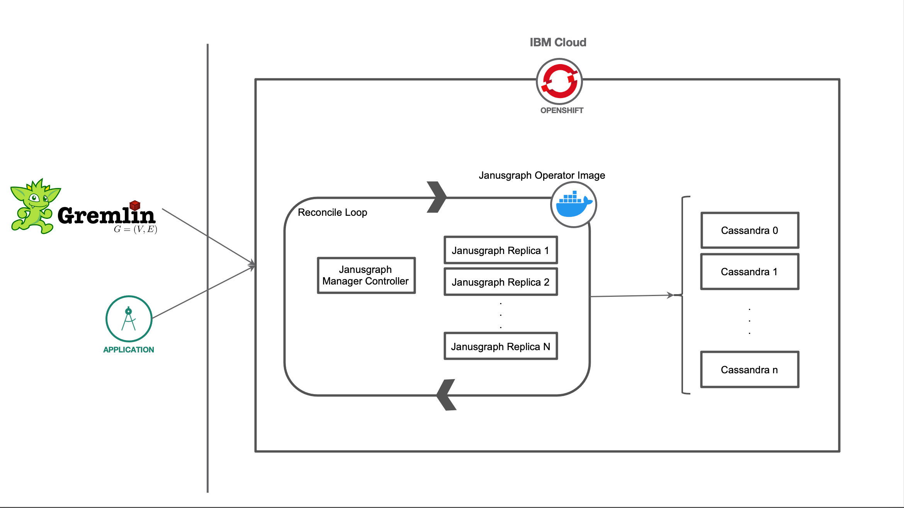
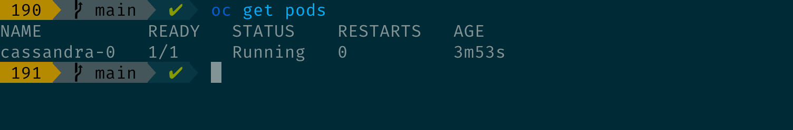
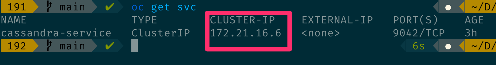
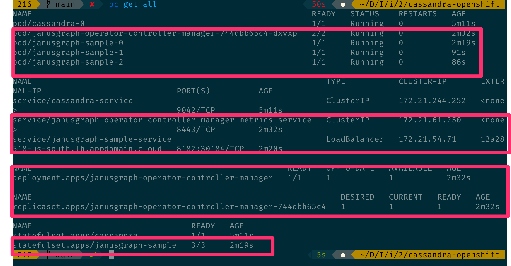
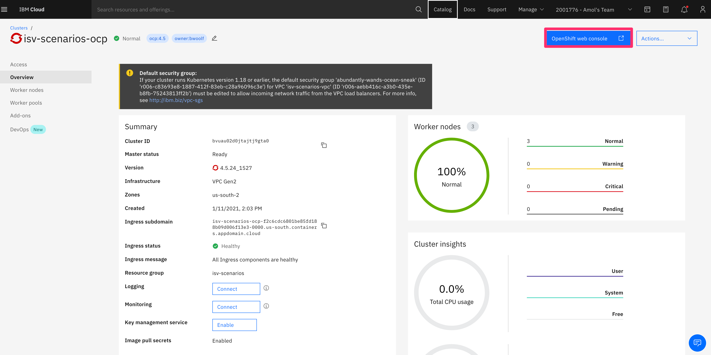
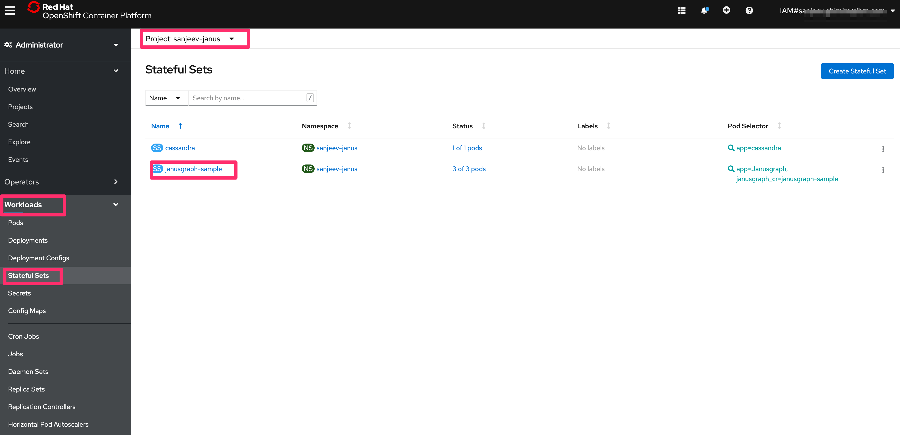
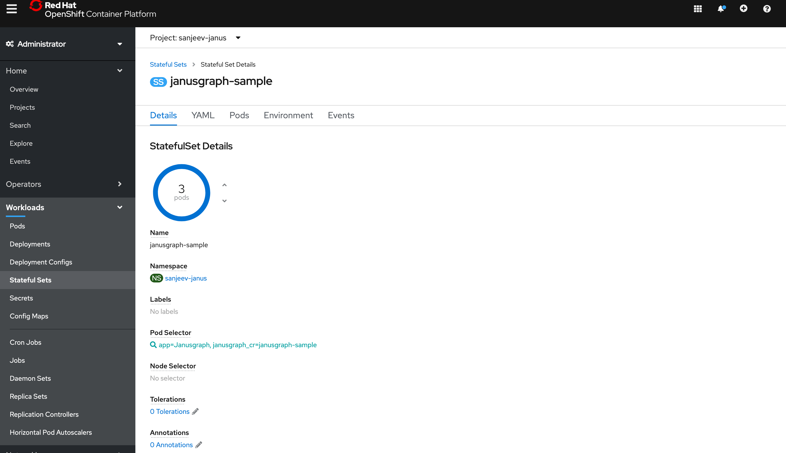

# LEVEL 1 : JanusGraph Operator using Cassandra - Part 2

In this tutorial, we will learn how to develop and deploy a Level 1 operator on the OpenShift Container Platform. We will be creating an operator for Janusgraph which will use Cassandra as an storage backend. Cassandra is a distributed database platform which can scale and be highly available, and can perform really well on any commodity hardware or cloud infrastructure. To learn more about Cassandra you can read more [here](https://casandra.apache.org).

When the reader has completed this tutorial, they will understand how to:
* Deploy Apache Cassandra as backend storage.
* Generate Janusgraph image customize to Openshift cluster.
* Deploy Janusgraph operator to openshift cluster.
* Scale Janusgraph instance up/down by modifying and applying the Custom Resource (CR) to Openshift cluster.

> Note: Cassandra deployment is not part of this tutorial. We assume that Cassandra is already available whether its deployed from operator hub or as a standalone deployment.

For a LEVEL 1, Janusgraph operator will have the following capabillities:
* Deployment of Janusgraph by creating Services, Deployments, RoleBinding.
* Make sure the managed resources reaches healthy state and conveys readiness of the resources to the user using the status block of the custom resource.
* Manages scalability by resizing the underlying resources by applying changes to the Custom Resource instance.

## Flow




## Included components

* [Apache Cassandra](https://cassandra.apache.org/) - The Apache Cassandra database is the right choice when you need scalability and high availability without compromising performance.
* [Janusgraph](https://janusgraph.org) - JanusGraph is a scalable graph database optimized for storing and querying graphs containing hundreds of billions of vertices and edges distributed across a multi-machine cluster.
* [Red Hat OpenShift](http://www.openshift.com) - Red Hat OpenShift is the hybrid cloud platform of open possibility: powerful, so you can build anything and flexible, so it works anywhere.


## Featured Technology

* [RedHat OpenShift Operator](https://www.openshift.com/learn/topics/operators): Automate the creation, configuration, and management of instances of Kubernetes-native applications.

## Pre-Requisites

* You have little or no experience developing operators
* You have some knowledge of Kubernetes Operators concepts
* You've created [memcached operator](https://github.ibm.com/TT-ISV-org/operator/blob/main/BEGINNER_TUTORIAL.md)
* You've read [Deep Dive into Memcached Operator Code](https://github.ibm.com/TT-ISV-org/operator/blob/main/INTERMEDIATE_TUTORIAL.md)
* You've setup your environment as shown in the [Setup your Environment](https://github.ibm.com/TT-ISV-org/operator/blob/main/installation.md) tutorial

## Steps

1. [Deploy Cassandra to OpenShift](#1-deploy-cassandra-to-openshift)
1. [Clone and Modify Janusgraph docker image](#2-clone-and-modify-janusgraph-docker-image)
1. [Deploy Janusgraph operator](#3-deploy-janusgraph-operator)
1. [Load and test retrieve of data using gremlin console](#3-load-and-test-retrieve-of-data-using-gremlin-console)
1. [Test sizing of Janusgraph using the operator](#4-test-sizing-of-janusgraph-using-the-operator)

### 1. Deploy Cassandra to OpenShift

Clone the `cassandra-openshift` locally. In a terminal, run:

```bash
$ git clone https://github.com/IBM/janusgraph-operator.git

$ cd cassandra-openshift
```

We need to update the default configurations of Cassandra so that it can be deployed to OpenShift. The changes are defined in the `Dockerfile`. In order to adapt to openshift environment, we need to change the group ownership and file permission to root. Although OpenShift runs containers using an arbitrarily assigned user ID, the group ID must always be set to the root group (0). And there are other changes that Cassandra needs for it to be successfully deployed which will not be covered part of this tutorial.

You can build and push the Cassandra image to your image repository by running following commands:
```bash
docker build -t cassandra:1.0

docker tag cassandra:1.0 <repository hostname>/<username>/cassandra:1.0

docker push <repository hostname>/<username>/cassandra:1.0

```

> Note: change "repository hostname" and "username" accordingly.

Once the image is built, you can now deploy Cassandra as `Stateful set` in openshift.

Run the following command to deploy Cassandra from the cloned directory in the terminal:

```bash
$ oc apply -f cassandra-app-v1.yaml -f cassandra-svc-v1.yaml
```

To make sure cassandra is running, it should create one instance of cassandra database. If you want to have multiple replicas, you can modify replicas in the `cassandra-app-v1.yaml`.



### 2. Clone and Modify Janusgraph docker image

The Janusgraph docker image from the official repo deploys fine with kubernetes but not for openshift. There are few things that needs to be modified before we deploy:

* Fork the repo `https://github.com/JanusGraph/janusgraph-docker`
* Change the file and group ownership to root (0) for related folders. Following modifications are applies to the `Dockerfile`:
```bash
chgrp -R 0 ${JANUS_HOME} ${JANUS_INITDB_DIR} ${JANUS_CONFIG_DIR} ${JANUS_DATA_DIR} && \
chmod -R g+w ${JANUS_HOME} ${JANUS_INITDB_DIR} ${JANUS_CONFIG_DIR} ${JANUS_DATA_DIR}

RUN chmod u+x /opt/janusgraph/bin/gremlin.sh
RUN chmod u+x /opt/janusgraph/conf/remote.yaml

```
* Change the `JANUS_PROPS_TEMPLATE` value to `cql` as we will be using cassandra as backend.
* Since we will only be using the latest version change the version to the latest in `build-images.sh`. We will create a copy of that file to `build-images-ibm.sh` and modify it there. Modifications includes commenting out few lines. The following modification will be applied to the build script:

```bash
# optional version argument
version="${1:-}"
# get all versions
# versions=($(ls -d [0-9]*))
# get the last element of sorted version folders
# latest_version="${versions[${#versions[@]}-1]}"

# override to run the latest version only:
versions="0.5"
latest_version="0.5"

```
* Create `janusgraph-cql-server.properties` in the latest version directory, which in our case is `0.5` and add the following porperties:

```bash
gremlin.graph=org.janusgraph.core.JanusGraphFactory
storage.backend=cql
storage.hostname=cassandra-service
storage.username=cassandra
storage.password=cassandra
storage.cql.keyspace=janusgraph
storage.cassandra.replication-factor=3
storage.cassandra.replication-strategy-class=org.apache.cassandra.locator.NetworkTopologyStrategy
cache.db-cache = true
cache.db-cache-clean-wait = 20
cache.db-cache-time = 180000
cache.db-cache-size = 0.5
storage.directory=/var/lib/janusgraph/data
index.search.backend=lucene
index.search.directory=/var/lib/janusgraph/index

```
These are properties that allows Janusgraph to talk to Cassandra as Cassandra will be storing the data in a distributed fashion.

After these changes, make sure to update `janusgraph-cql-server.properties` with the `cluster-ip` of cassandra service. Update `storage.hostname` with the `Cluster-IP`.



Now we can build and deploy the Janusgraph docker image to openshift by running:

```bash
$ ./build-images-ibm.sh -- if you have created a new file
```
OR

```bash
$ ./build-images.sh -- if you have modified file provided by Janusgraph
```

### 3. Deploy Janusgraph Operator

The operator project is created using `Operator SDK` and you can initialize and create project structure using the SDK. For our ease, we have already created a project structure using the SDK. If you want to learn more about Operator SDK and controller code structure, you can go to our operator articles [here](level-1-operator.md).

Our Custom Resource (CR) instance and Spec definition in our API looks like following:


<table>
<tr>
<th>Custom Resource (CR)</th>
<th>Spec API Definition</th>
</tr>
<tr>
<td>

```yaml
apiVersion: graph.ibm.com/v1alpha1
kind: Janusgraph
metadata:
  name: janusgraph-sample
spec:
  # Add fields here
  size: 3
  version: latest
``` 
</td>
<td>

```go
type JanusgraphSpec struct {}	
	Size    int32  `json:"size"`
	Version string `json:"version"`
}
```

</td>
</tr>
</table>


From the cloned project root directory, open `build-and-deploy.sh` script in an editor and change following parameters:

```bash
img="<image repo name>/<username>/<image name>:<tag>"
namespace="<namespace>"
```

and finally run the following from your terminal:

```bash
$ ./build-and-deploy.sh
```

For more information, you can checkout the controller code. The operator controller code is responsible for doing following tasks:
* Create services so that it can be exposed with an IP.
* Create deployments of Janusgraph images based on Custom Resource instance specification
* Conveys readiness of Jansgraph leveraging the status block of Custom Resource.

Let's take a look at all the resources that operator deployed for Janusgraph. Run following command in your terminal:
```bash
$ oc get all
```
Output:



### 4. Load and test retrieve of data using gremlin console

In order to load the data, there is a groovy script [load_data.groovy](https://github.ibm.com/TT-ISV-org/janusgraph-operator/blob/main/data/load_data.groovy), which you need to run from your gremlin console. First, download the gremlin console if you haven't already from https://tinkerpop.apache.org/downloads.html.

Once downloaded and unzipped, go to `conf/remote.yaml` and update with following configuration:

> NOTE: HOST_NAME below is the external IP from your cluster which can be retrieved using `oc get svc`. Copy the `EXTERNAL-IP` for `jansugraph-sample-service` and replace.

```yaml
hosts: [HOST_NAME]
port: 8182
serializer: { 
  className: org.apache.tinkerpop.gremlin.driver.ser.GryoMessageSerializerV3d0, config: { serializeResultToString: true }
}
connectionPool: {
  enableSsl: false,
  maxInProcessPerConnection: 16,
  # The maximum number of times that a connection can be borrowed from the pool simultaneously.
  maxSimultaneousUsagePerConnection: 32,
  # The maximum size of a connection pool for a host.
  maxSize: 32,
  maxContentLength: 81928192
}
# Size of the pool for handling background work. default : available processors * 2
workerPoolSize: 16
# Size of the pool for handling request/response operations. # default : available processors
nioPoolSize: 8

```

Copy the groovy script and paste it to the gremlin console data directory. Then from the terminal run the following from the root of your gremlin console.

```bash
$ bin/gremlin.sh

$ :remote connect tinkerpop.server conf/remote.yaml

```

Then run the following command to load the groovy script that you copied and pasted to the data directory:

```bash
$ :load data/load_data.groovy
```

This will load the data and to test to make sure the data has been successfully loaded, we will run a gremlin query to get all the airlines:
```bash
gremlin> g.V().has("object_type", "flight").limit(30000).values("airlines").dedup().toList()
==>MilkyWay Airlines
==>Spartan Airlines
==>Phoenix Airlines
```

We have now successfully loaded our data.

### 5. Test sizing of Janusgraph operator

In order to to make sure the operator runs successfully when scaling Janusgraph up or down, can be done from the console. Go to openshift console in IBM cloud.

From your provisioned cluster which which you have already setup part of pre-requisistes, select the cluster and go to `OpenShift web console` by clicking the button from top right corner of the page.



Then, choose your project by clicking `Projects` from the left navigation menu and selecting your `project name`, which is also the `namespace` that you have used before deploying the operator.

Then from the left navigation menu again, select `workloads` and click `Stateful Sets` to get the operator deployment. In the main page, you will see `janusgraph sample` as stateful deployment, select that deployment.



This will bring to a screen that shows the number of replicas that has been deployed.



To test the sizing of Janusgraph, you can increase the number of pods by clicking the up arrow next to pods and decrease by clicking the down arrow next to the pods.

After each increment and decrement, you can go to the terminal where you have connected to Janusgraph using gremlin console from your local machine, and run `get` commands to retrieve data back. On all resizing, you should consistently see the same amount of data retrieved. Run the following query to receive all the airlines with duplicat data removed: 

```bash
$ gremlin> g.V().has("object_type", "flight").limit(30000).values("airlines").dedup().toList()
```

This should consistently retrieve same data back despite of any number of resizing. The output will be as below: 

```bash
[
  "Spartan Airlines",
  "Phoenix Airlines",
  "MilkyWay Airline"
]
```

**Congratulations!** You've successfully deployed an Janusgraph operator `Level I`. And you also have tested the deployment with resizing the replicas and  checked the integrity of the data in new pods.

# License

This code pattern is licensed under the Apache Software License, Version 2.  Separate third party code objects invoked within this code pattern are licensed by their respective providers pursuant to their own separate licenses. Contributions are subject to the [Developer Certificate of Origin, Version 1.1 (DCO)](https://developercertificate.org/) and the [Apache Software License, Version 2](https://www.apache.org/licenses/LICENSE-2.0.txt).

[Apache Software License (ASL) FAQ](https://www.apache.org/foundation/license-faq.html#WhatDoesItMEAN)
